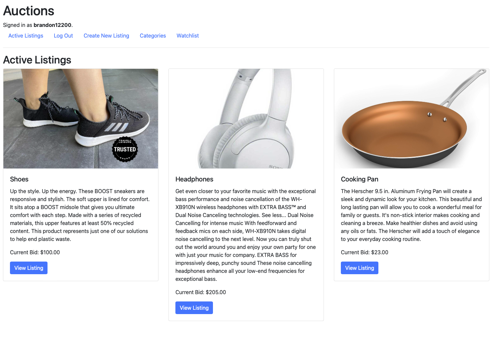
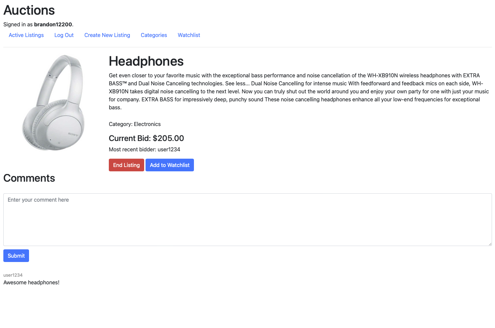
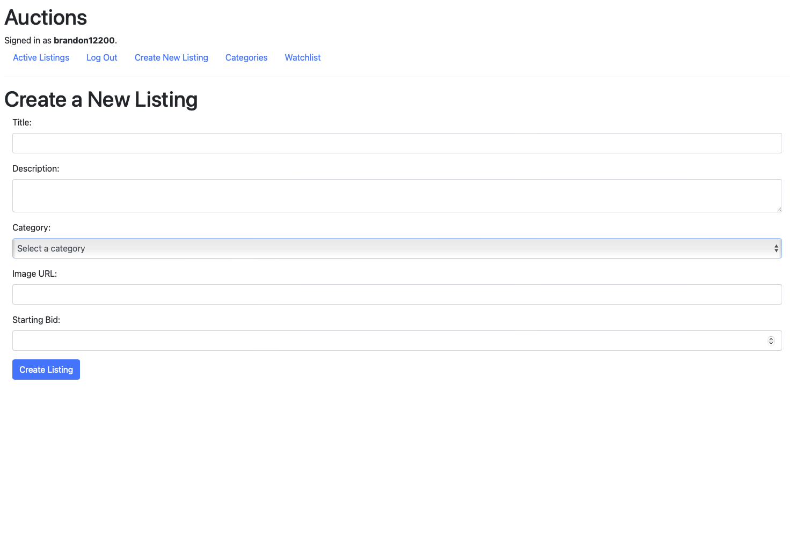

# Commerce

## Table of Contents

- [Description](#description)
- [Sample Output](#author)
- [Usage](#usage)
- [Implementation Details](#implementation-details)
- [Author](#author)

## Description

An auction application that enables users to list and bid on items.

Includes the following features:

- **User Authentication:**
  - Users can register, log in, and log out.

- **Listings:**
  - Users can view a list of available items for auction.

- **Create Listing:**
  - Authenticated users can create new listings.
  - Specify title, description, category, and an optional image.

- **View Listing Details:**
  - Users can view details of a specific listing.
  - Includes current bid, comments, and the ability to place a bid or add/remove the listing from their watchlist.

- **Place Bid:**
  - Authenticated users can place bids on listings.

- **Watchlist:**
  - Users can add and remove listings from their watchlist.

- **End Listing:**
  - Sellers can end their listings.

- **Comments:**
  - Users can add comments to listings.

- **Categories:**
  - Listings can be filtered by category.

## Sample Output







## Usage

To use this Django Auctions application, follow the steps below:

### 1. Install Dependencies

```bash
pip install django
```
### 2. Clone Repository

To clone the repository, run the following command in your terminal:

```bash
git clone https://github.com/Brandon12200/Commerce.git
```

### 3. Run Application

Navigate to the project directory and run the following commands:

```bash
cd django-auctions
python manage.py migrate
python manage.py runserver
```

## Implementation Details

### Database Models

The application uses the following Django models to manage data:

- **User Model (`User`):**
  - Inherits from `AbstractUser` for user authentication.
  - Includes a `watchlist` field to manage user-specific watchlists.

- **Listing Model (`Listing`):**
  - Represents items available for auction.
  - Fields include `title`, `description`, `image`, `category`, `current_bid`, `seller`, `created_at`, and `is_closed`.

- **Bid Model (`Bid`):**
  - Represents bids placed on listings.
  - Fields include `item` (foreign key to `Listing`), `amount`, `bidder` (foreign key to `User`), and `placed_at`.

- **Comment Model (`Comment`):**
  - Represents comments made on listings.
  - Fields include `item` (foreign key to `Listing`), `comment`, and `commenter` (foreign key to `User`).

### Forms

The application utilizes Django forms for creating and validating user inputs:

- **NewListingForm (`NewListingForm`):**
  - Form for creating new listings with fields for `title`, `description`, `image`, `category`, and `current_bid`.

- **NewBidForm (`NewBidForm`):**
  - Form for placing bids with a `bid_amount` field.

- **NewCommentForm (`NewCommentForm`):**
  - Form for adding comments with a `comment` field.

### Views

The `views.py` file contains various views and logic for handling HTTP requests:

- **index:** Renders the main page with a list of open listings.

- **create_listing:** Handles the creation of new listings.

- **view_listing:** Displays details of a specific listing, including bids and comments.

- **place_bid:** Handles the placement of bids on listings.

- **end_listing:** Allows sellers to end their listings.

- **add_comment:** Enables users to add comments to listings.

- **watchlist_add and watchlist_remove:** Add and remove listings from the user's watchlist.

- **view_watchlist:** Displays the user's watchlist.

- **category_listings:** Filters listings based on categories.

## Author
- Brandon Kenney, 2023


